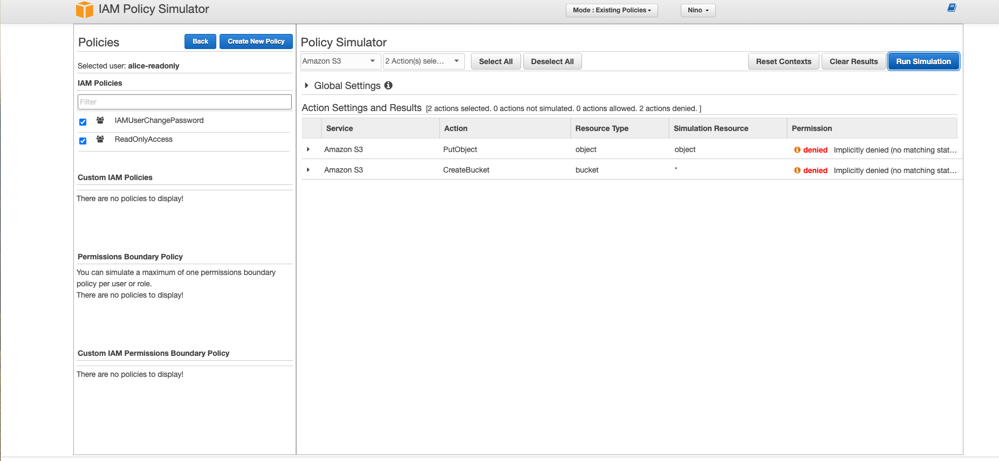

# Day 3 — IAM Policy Simulator Verification (S3)

**Goal:** Verify effective permissions for four users using **IAM Policy Simulator** (Chapter 4 fundamentals).  
**Scope:** Actions — `s3:CreateBucket`, `s3:PutObject` on `arn:aws:s3:::nino-iam-demo-eiam/*`.

## Results

| User               | CreateBucket | PutObject on `nino-iam-demo-eiam/*` | Why it resolves this way |
|--------------------|--------------|-------------------------------------|---------------------------|
| `alice-readonly`   | ❌ Deny       | ❌ Deny                              | ReadOnlyAccess allows read/list, **no write**. |
| `ben-s3writer`     | ❌ Deny       | ✅ **Allow**                          | Custom policy grants object RW **only** in target bucket; no bucket-create. |
| `cara-baseline`    | ❌ Deny       | ❌ Deny                              | Only self-service password policy; **no S3** perms. |
| `nino-dev-demo`    | ❌ Deny       | ✅ **Allow**                          | Member of the scoped writer group for target bucket. |

## How to Reproduce (admin session)
For each user: **IAM → Policy Simulator → Users → select user → Service: S3**  
- Check **`CreateBucket`** and **`PutObject`**  
- For `PutObject`, set **Resource ARN** to: `arn:aws:s3:::nino-iam-demo-eiam/*`  
- **Run simulation** and note Allow/Deny

## Screenshots (add later)
- `screenshots/day3-alice-putobject-deny.png`
- `screenshots/day3-ben-putobject-allow.png`

## Key Takeaways
- **Union of allows** controls effective permissions.
- **Implicit deny**: anything not explicitly allowed is denied.
- **Resource scoping matters** (`.../*` vs bucket ARN).

